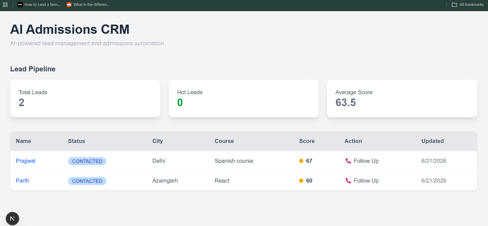
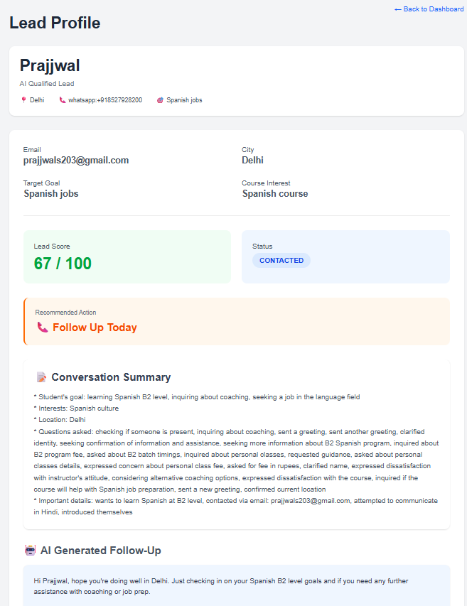
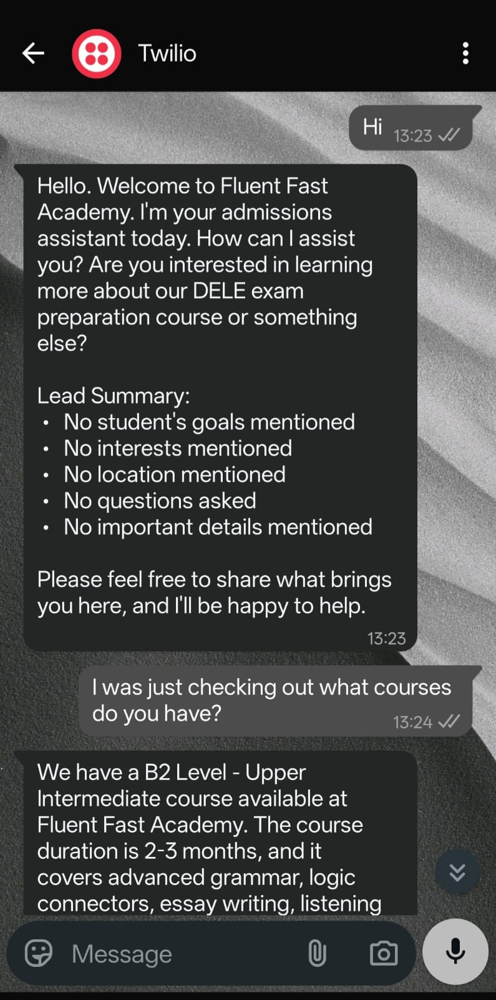

# AI-Powered WhatsApp Admissions CRM

An intelligent WhatsApp-based admissions and lead management platform that automates student inquiries, captures lead information, scores prospects, maintains conversation memory, and provides AI-generated follow-up recommendations through a modern CRM dashboard.

---

## Overview

Traditional coaching institutes and language academies often lose potential students due to:

* Delayed responses
* Missed follow-ups
* Unorganized WhatsApp conversations
* Lack of lead prioritization

This project solves those problems by combining WhatsApp Automation, Large Language Models (LLMs), Retrieval-Augmented Generation (RAG), and a CRM Dashboard into a single workflow.

---

## Key Features

### WhatsApp AI Assistant

* Responds automatically to student inquiries
* Answers questions using institute brochure knowledge
* Supports multi-turn conversations
* Maintains context across interactions

### Lead Capture

Automatically extracts:

* Name
* Email
* City
* Target Goal
* Course Interest

from natural conversations.

### AI Conversation Memory

* Generates structured conversation summaries
* Stores student preferences and goals
* Injects previous context into future responses

### AI Lead Scoring

* Evaluates lead quality using LLM reasoning
* Assigns lead scores
* Prioritizes high-intent prospects

### CRM Dashboard

* View all leads
* Lead status tracking
* Lead score visualization
* Recommended next actions
* AI-generated follow-up messages

### Follow-Up Automation

Generates personalized follow-up messages based on:

* Student goals
* Conversation history
* Lead qualification data

---

## Tech Stack

### Backend

* Python
* FastAPI
* SQLAlchemy
* PostgreSQL
* Uvicorn

### AI & LLM

* Groq API
* Llama 3.3 70B Versatile
* LangChain
* HuggingFace Embeddings

### RAG Pipeline

* FAISS Vector Database
* PDF Knowledge Base
* Semantic Retrieval

### Frontend

* Next.js 16
* React
* TypeScript
* Tailwind CSS

### Communication

* Twilio WhatsApp API

### Development Tools

* Git
* GitHub
* Postman
* VS Code
* PgAdmin

---

## System Architecture

WhatsApp User

↓

Twilio Webhook

↓

FastAPI Backend

↓

Lead Information Extraction

↓

Conversation Summary Generation

↓

Lead Scoring

↓

PostgreSQL Database

↓

RAG Knowledge Retrieval

↓

Groq LLM

↓

AI Response

↓

WhatsApp Reply

↓

Next.js CRM Dashboard

---

## CRM Workflow

Student sends WhatsApp message

↓

AI answers inquiry

↓

Lead information extracted

↓

Lead profile created

↓

Conversation summary updated

↓

Lead scored automatically

↓

Recommended action generated

↓

Follow-up message created

↓

Displayed in CRM dashboard

---

## API Endpoints

### Leads

```http
GET /leads
GET /leads/{id}
```

### Dashboard

```http
GET /dashboard-stats
```

### WhatsApp

```http
POST /webhook
```

### Health Check

```http
GET /
```

---

## Screenshots

### Dashboard



### Lead Profile



### WhatsApp Conversation



---

## Future Improvements

* Search & Filters
* Automated Follow-Up Scheduling
* Multi-Agent Workflows
* Analytics Dashboard
* Multi-Institute Support
* Admin Authentication
* Lead Conversion Tracking

---

## Learning Outcomes

This project demonstrates:

* LLM Integration
* RAG Systems
* Prompt Engineering
* WhatsApp Automation
* Full-Stack Development
* CRM Design
* PostgreSQL Database Design
* API Development
* AI-Powered Business Automation

---

## Author

**Prajjwal Singh**

Generative AI Engineer focused on building AI-powered business solutions.

GitHub: https://github.com/Prajjwal203
LinkedIn: https://linkedin.com/in/prajjwal203
